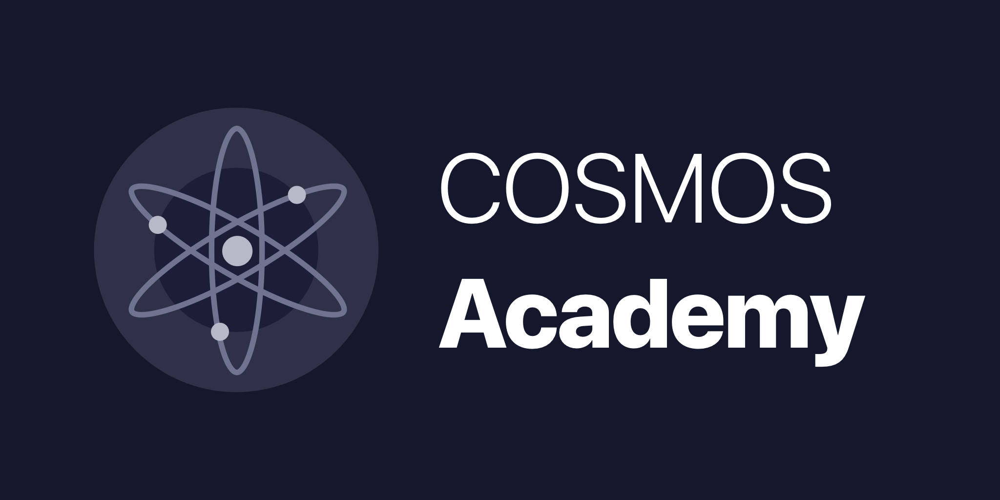

.. Cosmos Academy documentation master file, created by
   sphinx-quickstart on Mon Aug 14 11:52:37 2017.
   You can adapt this file completely to your liking, but it should at least
   contain the root `toctree` directive.

Cosmos Academy
==============

Welcome to the Cosmos Academy! This page will orient you around the Tendermint/Cosmos tech stack. It is roughly organized from beginner => expert with higher priority to content most relevant to many users.

Introduction
============

New here? Walk through some introductory content to get up to speed.

.. toctree::
   :maxdepth: 2

   content/introduction.md

Application Development
=======================

Discover the various development frameworks available to build your blockchain application.

.. toctree::
   :maxdepth: 2

   content/app-development.md

Testnets
========

Create a testnet for your application or join an existing one.

.. toctree::
   :maxdepth: 2

   content/testnets.md

Glossary
========

A bunch of words defined

.. toctree::
   :maxdepth: 1

   content/glossary.md

Concepts
========

Things that require more explanation than the glossary can provide

.. toctree::
   :maxdepth: 2

   content/concepts.md

Research
========

Here you'll find links to any and all technical research such as links to specifications and the like.

.. toctree::
   :maxdepth: 2

   content/research.md

Media
=====

Blogs and videos

.. toctree::
   :maxdepth: 2

   content/media.md

Community
=========

Find out the different ways to join or contribute to the community.

.. toctree::
   :maxdepth: 2

   content/community.md

External Resources
==================

Educational content produced and hosted by partners or external contributors can be found here.

.. toctree::
   :maxdepth: 2

   content/external-resources.md
